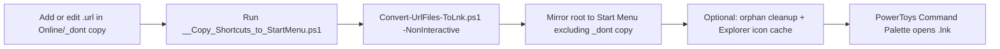

# Portable ecosystem (shortcuts template)

This folder is a **portable template**: copy it anywhere (or keep it in the blueprint repo). Paths in the scripts use `$PSScriptRoot` only—no fixed drive letters.

## Quick start

- [`Template/__Copy_Shortcuts_to_StartMenu.ps1`](Template/__Copy_Shortcuts_to_StartMenu.ps1): Mirrors this folder into a Start Menu programs subfolder (default `_My Shortcuts`) so portable apps and web shortcuts show up like installed apps. Uses **robocopy** so any directory named `_dont copy` is **never** synced, at any depth. Optionally runs [`Template/Online/_dont copy/Convert-UrlFiles-ToLnk.ps1`](Template/Online/_dont%20copy/Convert-UrlFiles-ToLnk.ps1) first to turn `.url` files into `.lnk` with favicons. In **AllUsers** mode it can list orphan items in the mirror, then optionally clear Explorer’s icon cache and restart Explorer.
- [`Template/Online/_dont copy/Convert-UrlFiles-ToLnk.ps1`](Template/Online/_dont%20copy/Convert-UrlFiles-ToLnk.ps1): Converts `.url` inputs next to the script into `.lnk` files in `Online\`, with icons under `Online/_dont copy/_UrlShortcutIcons\`. Run directly for interactive icon choice, or rely on the copy script (it passes **`-NonInteractive`**).
- [`Portable_Apps_with_Scoop_UniGetUI.ubundle`](Portable_Apps_with_Scoop_UniGetUI.ubundle): UniGetUI export bundle for this portable setup. Use it as a restore/import snapshot for the Scoop and Winget app set managed by the `scoop_UGU` workflow.

## Folder layout (what gets synced)

```text
10_Portable_Ecosystem/                 ← template root: mirrored to Start Menu
  __Copy_Shortcuts_to_StartMenu.ps1   ← run after you change shortcuts
  Portable_Ecosystem.md               ← this guide
  *.lnk                               ← program shortcuts (examples)
  Scoop/                              ← optional: Scoop-related shortcuts only
    *.lnk
  Online/                             ← web shortcuts that sync (outputs)
    *.lnk                             ← built from .url; PowerToys indexes these
    _dont copy/                       ← NOT copied — inputs + tools + icon cache
      *.url                           ← Internet shortcuts (your inputs)
      Convert-UrlFiles-ToLnk.ps1
      _UrlShortcutIcons/              ← downloaded favicons (.ico)
      …                               ← other assets (helpers, etc.)
```

Any folder named `_dont copy` at **any depth** is excluded from the Start Menu mirror (including `Online\_dont copy`).

## One-command workflow (PowerToys Command Palette)

PowerToys Command Palette indexes **Start Menu** shortcuts; syncing this tree makes your `.lnk` files easy to launch by name.



1. Put **Internet shortcuts** (`.url`) in `Online/_dont copy/` (same base name as the `.lnk` you want).
2. Run **`__Copy_Shortcuts_to_StartMenu.ps1`** from this folder.
   - Regenerates `Online\*.lnk` via the converter (**website favicons**, no prompts).
   - Copies everything under the template root into your Start Menu folder, **skipping every `_dont copy`** folder.
   - **AllUsers** mode: may offer to remove orphan files in the mirror, then optionally clear the icon cache and restart Explorer.
3. In **PowerToys Command Palette**, launch shortcuts by name (same as Start Menu).

## Script switches

| Script | Switch | Meaning |
|--------|--------|--------|
| `__Copy_Shortcuts_to_StartMenu.ps1` | `-SkipUrlConvert` | Sync only; do not run the URL→LNK converter first. |
| `Online/_dont copy/Convert-UrlFiles-ToLnk.ps1` | `-NonInteractive` | No icon prompt; default = website favicon (used by the copy script). |
| | `-BrowserIconsOnly` | With `-NonInteractive`, use default browser icon only (no download). |

With **AllUsers**, the copy script re-launches elevated and preserves **`-SkipUrlConvert`** if you passed it.

## Conventions

- **Keep `.url` files under `Online/_dont copy` only** so published web shortcuts are clearly the `.lnk` files in `Online\`.
- **Program / Scoop shortcuts**: place `.lnk` (or subfolders) on the template root or under `Scoop\`; they sync with the rest of the tree.

## Start Menu target (edit the copy script)

Inside `__Copy_Shortcuts_to_StartMenu.ps1`:

- `$targetSubDir` — folder name under `Programs` (default `_My Shortcuts`).
- `$StartMenuScope` — `CurrentUser` or `AllUsers` (AllUsers requires admin once).
